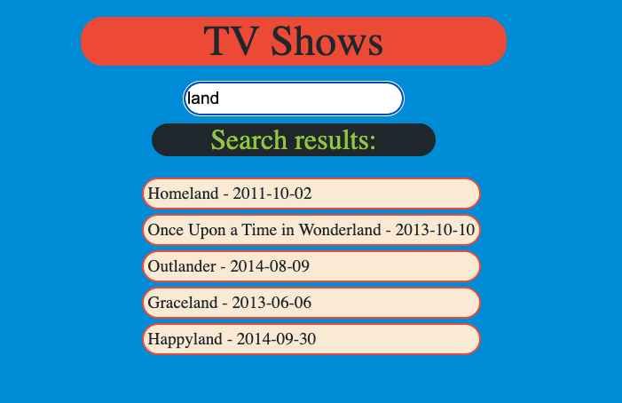
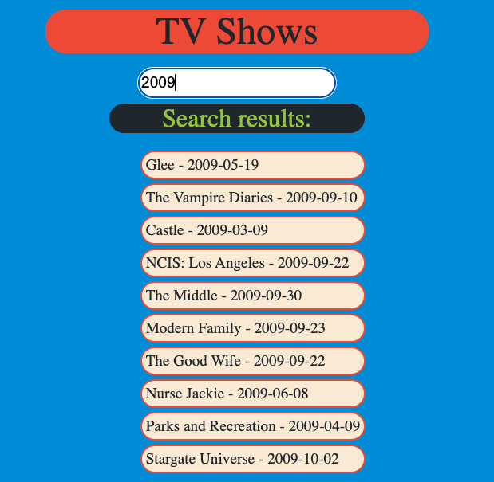

# TV show API
An exercise to practice and solidify retrieving and wokring with a public API in React.

The API is taken from <a href="https://api.tvmaze.com/shows">https://api.tvmaze.com/shows</a>

Inital display:

Filtered to search entries by title:

And to search by year: 
